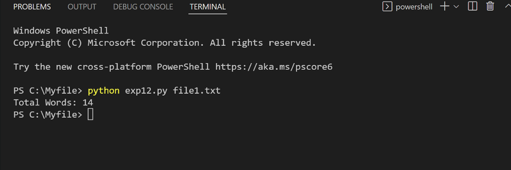

# command-line-arguments-to-count-word
## AIM:
To write a python program for getting the word count from the contents of a file using command line arguments.
## EQUIPEMENT'S REQUIRED: 
PC
Anaconda - Python 3.7
## ALGORITHM: 

Step 1:

Get the file name using command arguments.
Step 2:

Now read the content in the file.
Step 3:

use split().
Step 4:

Now read the no.of words in file.
Step 5:

Print number of words present in given file.
Step 6:

End of the program.

## PROGRAM:
```
#DEVELOPED BY: karthick P
#REGISTER NO:22000995
import sys
fp= open(sys.argv[1])
data=fp.read()
words=data.split()
print("Total Words:",len(words))
```
### OUTPUT:




## RESULT:
Thus the program is written to find the word count from the contents of a file using command line arguments.
